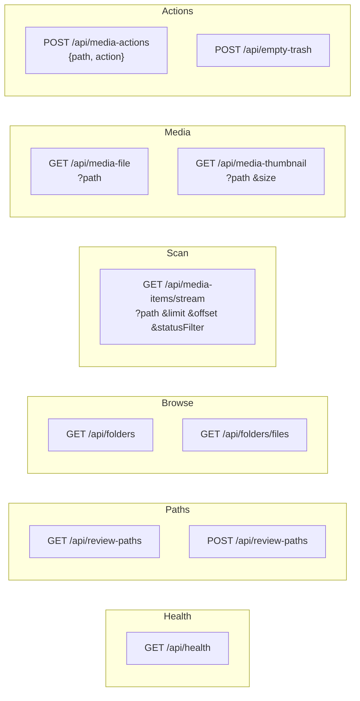
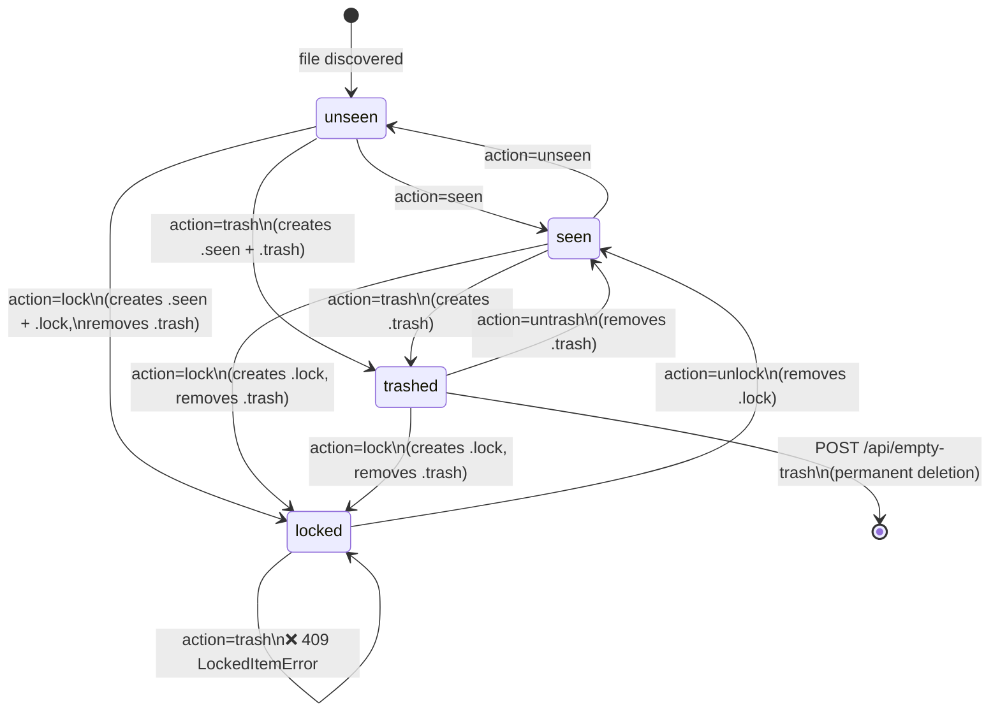
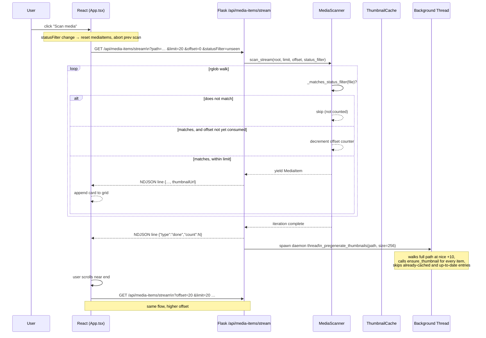

# Media Reviewer Architecture Diagrams

> Auto-generated reference. Re-run `docs/scripts/generate-diagrams.sh` after structural changes.

---

## 1. System Components

```mermaid
graph TB
    subgraph Client["Browser / Mobile"]
        UI["React + Vite SPA\n(TypeScript)"]
    end

    subgraph Server["Host — mediareviewer-api"]
        Flask["Flask API\n:5200"]
        Scanner["MediaScanner\nservice"]
        Companion["CompanionActionService"]
        ThumbCache["ThumbnailCacheService"]
        DelQueue["DeletionQueue\n(counter placeholder)"]
        Config["ReviewConfigStore\n~/.mediareviewer/config.yaml"]
    end

    subgraph Storage["Filesystem"]
        MediaFiles["Media files\n(jpg / mp4 / …)"]
        CompanionFiles["Companion files\n(.lock / .trash / .seen)"]
        ThumbDir[".thumbnails/\n(content-addressed PNG cache)"]
        UserConfig["~/.mediareviewer/\nconfig.yaml"]
        NAS["/mnt/… network share\n(CIFS automount, soft, _netdev)"]
    end

    subgraph BG["Background"]
        WarmThread["Thumbnail warm thread\n(daemon, nice +10)"]
    end

    UI -->|"HTTP JSON + NDJSON stream"| Flask
    Flask --> Scanner
    Flask --> Companion
    Flask --> ThumbCache
    Flask --> DelQueue
    Flask --> Config
    Scanner -->|"rglob scan"| MediaFiles
    Scanner -->|"reads companion stat"| CompanionFiles
    Companion -->|"create/unlink"| CompanionFiles
    ThumbCache -->|"PIL / ffmpeg"| MediaFiles
    ThumbCache -->|"read/write PNG"| ThumbDir
    Config -->|"known_paths"| UserConfig
    MediaFiles --- NAS
    CompanionFiles --- NAS
    ThumbDir --- NAS
    Flask -.->|"spawns on scan"| WarmThread
    WarmThread -->|"ensure_thumbnail"| ThumbCache
```



---

## 2. API Routes



---

## 3. Companion File State Machine

Each media file `foo.mp4` can have up to three zero-byte companion files alongside it: `foo.mp4.lock`, `foo.mp4.trash`, `foo.mp4.seen`.



**Rules:**
- `trash` is blocked on locked items (backend returns 409; frontend shows warning modal).
- `lock` implies `seen` and also removes any `.trash` companion (locking un-trashes).
- `trash` implies `seen`.
- Items can be both `seen` and `locked` simultaneously.
- Items can be both `seen` and `trashed` simultaneously (locked+trashed is prevented).

---

## 4. Trash & Deletion Flow (Empty Trash)

This is the sequence executed when you press **Empty Trash**.

```mermaid
sequenceDiagram
    participant User
    participant Frontend as React Frontend
    participant API as Flask /api/empty-trash
    participant FS as Filesystem (per review path)
    participant TC as ThumbnailCache

    User->>Frontend: click "Empty Trash"
    Frontend->>API: POST /api/empty-trash

    loop for each configured known_path
        API->>FS: rglob("*") — walk all files
        FS-->>API: candidate file list

        loop for each candidate
            API->>FS: check candidate.suffix + ".trash" exists?
            alt .trash NOT present
                API-->>API: skip
            else .trash present
                API->>FS: check candidate.suffix + ".lock" exists?
                alt .lock present (locked item)
                    API-->>API: skip — protected, never auto-deleted
                else not locked
                    API->>FS: unlink .lock (if exists)
                    API->>FS: unlink .trash
                    API->>FS: unlink .seen (if exists)
                    API->>TC: delete_thumbnail(candidate, review_path)
                    TC->>FS: unlink .thumbnails/large/<hash>.png (if exists)
                    TC->>FS: unlink .thumbnails/normal/<hash>.png (if exists)
                    API->>FS: unlink candidate (the media file itself)
                    API-->>API: append to deleted[]
                end
            end
        end

        API->>TC: prune_orphaned_thumbnails(review_path)
        Note over TC,FS: reads Thumb::URI from each PNG in .thumbnails/;<br/>removes any thumbnail whose source path no longer exists
    end

    API-->>Frontend: {deleted: N, paths: [...], errors: [...]}
    Frontend-->>User: show confirmation / reload grid
```

**Key safety properties:**
- A file with **both** `.lock` and `.trash` companions is **skipped** — locked items are never permanently deleted by empty-trash regardless of trash status.
- Deletion order: companions first, then thumbnail, then media file — partial failures leave the media file intact.
- `errors[]` collects `OSError` messages per file; successfully deleted items are still returned even when some files error.
- After deletion, `prune_orphaned_thumbnails` cleans up any thumbnail whose source was deleted externally (outside this app) since the last trash cycle.

---

## 5. Scan & Stream Flow



---

## 6. Thumbnail Generation & Caching

```mermaid
flowchart TD
    A["ensure_thumbnail(media_path, review_path, size)"]
    A --> B["compute cache path\nmd5(file_uri).png\nin review_path/.thumbnails/large/"]
    B --> C{thumbnail exists\nand mtime ≥ media mtime?}
    C -->|yes| D["return cached path\nwas_generated=False"]
    C -->|no| E{media type?}

    E -->|image| F["PIL: open → EXIF transpose\n→ thumbnail → centre on canvas\n→ _save_thumbnail_png"]
    E -->|video| G["ffmpeg: extract frame at 2 s\n-y, tempfile.mkstemp, timeout=30s"]
    E -->|other| J["generate placeholder PNG\nwith label + extension"]

    G -->|success| H["PIL: open temp frame\n→ centre on canvas\n→ _save_thumbnail_png"]
    G -->|failure\n(CalledProcessError,\nTimeoutExpired,\nFileNotFoundError,\nOSError)| I["generate placeholder PNG"]

    H --> K["return ThumbnailResult\nwas_generated=True"]
    F --> K
    J --> K

    I --> L["os.utime(thumbnail, (0, 0))\nmark stale so next request retries"]
    L --> K

    style L fill:#f9c,stroke:#c00
    style D fill:#cfc,stroke:#090
```

**Cache location:** `<review_path>/.thumbnails/large/<md5>.png`  
The `md5` is computed from the media file URI (`file:///absolute/path`) so the filename is stable regardless of the review root name.
